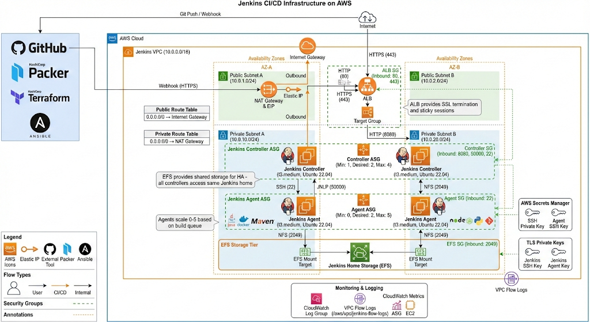
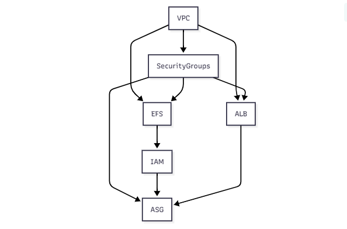

## Jenkins AWS CI/CD Infrastructure Automation

A production-ready Jenkins CI/CD infrastructure on AWS with HA controllers, auto-scaling agents, and persistent storage, all provisioned with Infrastructure as Code. This project demonstrates how to build and operate Jenkins on AWS using Terraform, Packer, Ansible, GitHub Actions, and AWS networking and security best practices.

---

## Table of Contents

- [Motivation / Why This Project](#motivation--why-this-project)
- [Architecture](#architecture)
- [IAM Roles & Policies](#iam-roles--policies)
- [Security Groups](#security-groups)
- [Terraform Modules](#terraform-modules)
- [Prerequisites](#prerequisites)
- [Installation / Setup Instructions](#installation--setup-instructions)
- [Usage Examples](#usage-examples)
- [Project Structure](#project-structure)
- [How We Used Each Tool](#how-we-used-each-tool)
- [Learning Outcomes](#learning-outcomes)
- [Challenges & Solutions](#challenges--solutions)
- [Future Improvements](#future-improvements)
- [Contributing](#contributing)
- [License](#license)
- [Author & Contact](#author--contact)

---

## Motivation / Why This Project

This project was built to deeply understand how to run Jenkins the way real teams do it in production: highly available, automated, and safe to change. Instead of a single EC2 instance with a manually installed Jenkins, the goal is to design a full CI/CD platform on AWS that can survive failures, scale with load, and be recreated from scratch using code.

From a learning perspective, this repository is a practical lab for mastering:
- **Infrastructure as Code (IaC)** with Terraform for VPC, networking, security groups, EFS, ALB, IAM, and Auto Scaling.
- **Immutable infrastructure** with Packer and Ansible to build golden AMIs for Jenkins controllers and agents.
- **Cloud-native storage and HA patterns** using EFS for Jenkins home and an Application Load Balancer in front of an Auto Scaling Group of controllers.
- **CI/CD for infrastructure itself** using GitHub Actions to validate, build, plan, and apply changes safely.

It is also a portfolio-ready project: the architecture, code, and documentation are written so that an employer or interviewer can quickly understand the design decisions, trade-offs, and your problem-solving approach.

---

## Architecture

At a high level, the system consists of:
- **Jenkins Controller Auto Scaling Group** in private subnets (2+ AZs).
- **On-demand Jenkins Agents** launched via the EC2 plugin, also in private subnets.
- **Application Load Balancer (ALB)** in public subnets terminating TLS and routing traffic to the controllers.
- **Amazon EFS** for a shared Jenkins home directory mounted by all controllers.
- **Terraform remote state** stored in S3 with native state locking.
- **IAM roles and AWS Secrets Manager** for secure access to AWS services and controller–agent SSH keys.

### Architecture Diagram

The detailed architecture diagram is stored in `docs/images/updatedarch.png` and rendered below:



For a full textual breakdown of the components, responsibilities, data flow, security model, and failure scenarios, see `docs/architecture.md`.

---

## IAM Roles & Policies

This project follows the **principle of least privilege** – each role has only the permissions it needs, nothing more.

### Controller Role

The Jenkins controller needs permissions to:

| Policy | Purpose |
|--------|--------|
| **EFS Access** | Mount and write to the shared filesystem (`ClientMount`, `ClientWrite`, `DescribeFileSystems`) |
| **EC2 Management** | Launch and terminate agent instances via EC2 plugin (`RunInstances`, `TerminateInstances`, `DescribeInstances`) |
| **Secrets Manager** | Retrieve the SSH private key for agent connections (`GetSecretValue`) |
| **IAM PassRole** | Pass the agent role to launched EC2 instances |
| **SSM Core** | Enable Session Manager access for secure, keyless administration |
| **CloudWatch Agent** | Ship logs and metrics to CloudWatch |

### Agent Role

Agents are lighter and only need:

| Policy | Purpose |
|--------|--------|
| **ECR Access** | Pull Docker images for containerized builds (`GetAuthorizationToken`, `BatchGetImage`) |
| **S3 Access** | Read/write build artifacts to S3 buckets |
| **SSM Core** | Session Manager access for debugging |
| **CloudWatch Agent** | Ship logs and metrics |

### Instance Profiles

Both roles are attached to instance profiles (`*-controller-profile` and `*-agent-profile`) which are then assigned to the respective EC2 instances.

---

## Security Groups

Four security groups control all network traffic with explicit allow rules:

```
INTERNET
    │
    │ HTTPS (443) / HTTP (80)
    ▼
┌─────────────────┐
│   ALB SG        │
│   (sg-alb)      │
└────────┬────────┘
         │
         │ HTTP (8080)
         ▼
┌─────────────────┐         SSH (22)        ┌─────────────────┐
│  CONTROLLER SG  │ ──────────────────────► │    AGENT SG     │
│ (sg-controller) │                         │   (sg-agent)    │
└────────┬────────┘ ◄────────────────────── └─────────────────┘
         │              JNLP (50000)
         │
         │ NFS (2049)
         ▼
┌─────────────────┐
│    EFS SG       │
│   (sg-efs)      │
└─────────────────┘
```

### Security Group Rules

| Security Group | Inbound | Source | Purpose |
|----------------|---------|--------|--------|
| **ALB** | 80, 443 | `0.0.0.0/0` | Public HTTPS access |
| **Controller** | 8080 | ALB SG | Jenkins UI from load balancer |
| **Controller** | 50000 | Agent SG | JNLP agent connections |
| **Controller** | 22 | VPC CIDR | SSH for debugging |
| **Agent** | 22 | Controller SG | SSH from controller to launch agent process |
| **Agent** | 22 | VPC CIDR | SSH for debugging |
| **EFS** | 2049 | Controller SG | NFS mount from controllers only |

**Key security points:**
- Controllers and agents have **no public IPs** – they reside in private subnets.
- Only the ALB is internet-facing.
- EFS only accepts connections from controllers, not agents.

---

## Terraform Modules

The infrastructure is organized into six reusable modules under `terraform/modules/`:

| Module | Purpose | Key Resources |
|--------|---------|---------------|
| `vpc` | Network foundation | VPC, public/private subnets, Internet Gateway, NAT Gateway, route tables |
| `security-groups` | Network firewall rules | 4 security groups (ALB, Controller, Agent, EFS) |
| `efs` | Shared storage | EFS filesystem, mount targets in each AZ, access points |
| `alb` | Load balancing | Application Load Balancer, target group, listeners (HTTP redirect, HTTPS) |
| `iam` | Access control | Controller and Agent roles, policies, instance profiles |
| `asg` | Compute layer | Auto Scaling Groups, launch templates for controller and agent |

### Module Dependencies



Each module exposes outputs that feed into dependent modules (e.g., VPC outputs subnet IDs used by EFS, ALB, and ASG).

---

## Prerequisites

To provision and use this project you will need:

- **AWS Account**
  - IAM user or role with permissions for VPC, EC2, ALB, EFS, IAM, S3, Secrets Manager, and Auto Scaling.
- **Local tooling**
  - Terraform **1.10+**
  - Packer **1.10+**
  - Ansible **2.16+**
  - AWS CLI v2
  - Git
- **Operating system**
  - Linux, macOS, or Windows with WSL2 (recommended for a smoother CLI experience).
- **Optional but recommended**
  - An ACM certificate in the target region if you want HTTPS on the ALB.
  - A DNS domain in Route 53 (e.g., `jenkins.example.com`) pointing to the ALB.

---

## Installation / Setup Instructions

### 1. Clone the repository

```bash
git clone https://github.com/<your-github-username>/jenkins_config.git
cd jenkins_config
```

### 2. Configure AWS credentials

Use either the AWS CLI or environment variables so Terraform, Packer, and Ansible can authenticate.

```bash
aws configure
# or export AWS_ACCESS_KEY_ID / AWS_SECRET_ACCESS_KEY / AWS_SESSION_TOKEN / AWS_REGION
```

### 3. Bootstrap Terraform remote state (S3)

Create the S3 bucket and IAM policy for remote state using the bootstrap module:

```bash
cd terraform/bootstrap
terraform init
terraform apply
```

Note the `backend_config` output – you will paste this into `terraform/backend.tf` in the root Terraform directory.

### 4. Enable the remote backend

Open `terraform/backend.tf` and replace the commented example backend with the `backend_config` output from the bootstrap step. Then migrate your state:

```bash
cd ../        # back to terraform/ root
terraform init -migrate-state
```

Now Terraform state is stored centrally in S3 with native locking (no DynamoDB required).

### 5. Build Jenkins Controller and Agent AMIs with Packer

From the project root:

```bash
cd packer
packer init .

# Build controller AMI
packer build -only="amazon-ebs.jenkins_controller" .

# Build agent AMI
packer build -only="amazon-ebs.jenkins_agent" .
```

Each build will output a manifest JSON file (e.g., `manifest-controller.json` and `manifest-agent.json`) containing the AMI IDs.

Example of extracting the controller AMI ID with `jq`:

```bash
cat manifest-controller.json | jq -r '.builds[0].artifact_id'
# e.g. aws:ami:eu-west-1:123456789012:ami-0abc1234def567890
```

Use the `ami-...` portion as the value for the Terraform variables.

### 6. Configure Terraform variables

Create a `terraform/terraform.tfvars` file with your environment-specific values:

```hcl
project_name         = "jenkins"
environment          = "dev"
aws_region           = "eu-west-1"

controller_ami_id    = "ami-xxxxxxxxxxxxxxxxx"
agent_ami_id         = "ami-yyyyyyyyyyyyyyyyy"

alb_certificate_arn  = "arn:aws:acm:eu-west-1:123456789012:certificate/..."
create_ssh_key       = true

additional_tags = {
  Owner      = "Prince"
  ManagedBy  = "Terraform"
  CostCenter = "lab"
}
```

Adjust instance types, desired capacities, and other variables in `terraform/variables.tf` as needed (for example, `controller_desired_size`, `agent_desired_size`, or CIDR ranges).

### 7. Provision the Jenkins infrastructure

From the `terraform/` directory:

```bash
terraform init
terraform plan
terraform apply
```

When the apply completes, note the outputs (such as the ALB DNS name). You can fetch them later with:

```bash
terraform output
```

### 8. Access the Jenkins UI

Once the ALB is healthy and the controllers are up:

1. Open the ALB DNS name (or your custom domain) in a browser:
   - `https://<alb-dns-name>` or `https://jenkins.example.com`
2. Retrieve the initial admin password from the controller (via SSM Session Manager or SSH) at:
   - `/var/lib/jenkins/secrets/initialAdminPassword`
3. Complete the Jenkins setup wizard and install recommended plugins (or align with the Ansible-defined plugin set).

---

## Usage Examples

### Scale Jenkins agents

To handle more build load, increase the desired agent count and apply:

```hcl
# terraform/terraform.tfvars
agent_desired_size = 4
agent_max_size     = 6
```

```bash
cd terraform
terraform apply
```

The Auto Scaling Group will launch additional agent instances based on the agent AMI, and the Jenkins EC2 plugin will attach them as build workers.

### Integrate with GitHub webhooks

1. In Jenkins, create a new multibranch pipeline or pipeline job pointing at your GitHub repository.
2. Configure a GitHub webhook to point to your Jenkins URL (e.g., `https://jenkins.example.com/github-webhook/`).
3. On every push or pull request, GitHub will trigger Jenkins, which in turn launches agents to run the pipeline.

### Run the infrastructure CI/CD pipeline (GitHub Actions)

This repository includes a GitHub Actions workflow (and a plan for a full `jenkins-infra.yml` workflow as described in `docs/learning/cicd.md`) that can:
- Validate Packer templates.
- Lint Ansible roles.
- Validate Terraform.
- Build AMIs and run `terraform plan` and `terraform apply` with manual approval.

Trigger the workflow by pushing to the main branch or opening a pull request, depending on how you configure `.github/workflows/`.

---

## Project Structure

```text
jenkins_config/

├── .github/workflows/       # CI/CD workflows (PR validation, infra pipeline)
├── ansible/                 # Ansible cfg, playbooks, and roles for controller/agent/EFS
├── packer/                  # Packer templates for controller and agent AMIs
├── terraform/               # Root Terraform config and modules
│   ├── bootstrap/           # One-time S3 backend and IAM setup
│   └── modules/             # VPC, security-groups, efs, alb, iam, asg, etc.
├── docs/                    # Architecture, learning docs, runbooks, diagrams
│   └── images/              # Architecture diagrams (e.g., updatedarch.png)
└── content/                 # Content guides and AI prompts for documentation
```

See `docs/files-to-create.md` for a detailed, file-by-file breakdown of the intended structure across Terraform, Ansible, Packer, scripts, and GitHub Actions.

---

## How We Used Each Tool

This section explains **why** each tool was chosen and **how** it's used in this project.

---

### Terraform — Infrastructure as Code

**Why Terraform?**  
Terraform allows us to define, version, and recreate the entire AWS infrastructure from code. No manual clicking in the AWS console—everything is reproducible and auditable.

**How we used it:**

| Component | What Terraform Manages |
|-----------|----------------------|
| **VPC Module** | VPC, public/private subnets across 2+ AZs, Internet Gateway, NAT Gateway, route tables |
| **Security Groups Module** | 4 security groups with least-privilege inbound/outbound rules |
| **EFS Module** | Elastic File System with mount targets in each AZ |
| **ALB Module** | Application Load Balancer, target groups, HTTP→HTTPS redirect, health checks |
| **IAM Module** | Controller and Agent roles, policies, instance profiles |
| **ASG Module** | Auto Scaling Groups, launch templates for controller and agent |
| **Bootstrap Module** | S3 bucket for remote state with native locking (no DynamoDB needed) |

**Key design decisions:**
- **Modular architecture**: Each AWS component is a separate module for reusability and testability.
- **Remote state in S3**: Enables team collaboration and CI/CD; uses `use_lockfile = true` for safe concurrent access.
- **Variables and outputs**: All modules expose outputs that feed into dependent modules.

---

### Packer — Immutable AMI Building

**Why Packer?**  
Packer builds "golden images" (AMIs) that are pre-configured and ready to launch. This eliminates configuration drift and reduces instance boot time from 10+ minutes to under 2 minutes.

**How we used it:**

| Template | Output | Purpose |
|----------|--------|---------|
| `jenkins-controller.pkr.hcl` | Controller AMI | Ubuntu 22.04 + Java 17 + Jenkins server + plugins |
| `jenkins-agent.pkr.hcl` | Agent AMI | Ubuntu 22.04 + Java 17 + Docker + Maven + Node.js + Git |

**Build process:**
1. **Launch**: Packer launches a temporary EC2 instance from the latest Ubuntu 22.04 AMI.
2. **Wait for cloud-init**: Ensures the OS is fully initialized before installing packages.
3. **Update packages**: Applies latest security patches.
4. **Run Ansible**: Packer invokes Ansible to install and configure all software.
5. **Cleanup**: Removes temporary files, logs, and SSH keys for a clean image.
6. **Snapshot**: Creates the AMI and outputs a manifest JSON with the AMI ID.

**Key design decisions:**
- **Encrypted AMIs**: `encrypt_boot = true` for security compliance.
- **Manifest output**: CI/CD reads `manifest-controller.json` and `manifest-agent.json` to get AMI IDs.
- **Separate templates**: Controller and agent have different software needs—separation enables independent updates.

---

### Ansible — Configuration Management

**Why Ansible?**  
Ansible is agentless (uses SSH), readable (YAML playbooks), and idempotent (safe to run multiple times). It handles all software installation and configuration.

**How we used it:**

**Playbooks:**
- `playbooks/jenkins-controller.yml` — Configures the controller node.
- `playbooks/jenkins-agent.yml` — Configures agent nodes.

**Roles (modular, reusable units):**

| Role | Purpose | Key Tasks |
|------|---------|-----------|
| `common` | Base setup for all nodes | System updates, common packages (git, curl, jq), timezone, Jenkins user creation |
| `java` | Install Java JDK | Java 17 installation, JAVA_HOME configuration |
| `jenkins-controller` | Jenkins server installation | Add Jenkins repo, install package, configure ports/memory, install plugins |
| `jenkins-agent` | Agent tooling | Docker, Maven, Node.js, Python, build tools |
| `efs` | EFS mount (conditional) | NFS utilities, mount point creation (skipped during Packer build, used at runtime) |

**Key design decisions:**
- **Role execution order**: `common` → `java` → `jenkins-*` → `efs` ensures dependencies are satisfied.
- **Conditional EFS role**: Skipped during Packer build (`skip_efs_role: true`), mounted at runtime via Terraform `user_data`.
- **Plugin pre-installation**: Jenkins plugins are installed during AMI build so new instances are immediately ready.
- **Idempotent tasks**: Every task can be re-run safely without breaking the system.

---

### GitHub Actions — CI/CD Pipeline

**Why GitHub Actions?**  
Native integration with GitHub repositories, free tier for public repos, and declarative YAML workflows make it ideal for infrastructure CI/CD.

**How we used it:**

| Workflow Stage | What It Does |
|----------------|--------------|
| **Validate** | `terraform validate`, `packer validate`, `ansible-lint` |
| **Build AMIs** | Run Packer to build controller and agent AMIs |
| **Plan** | `terraform plan` to preview infrastructure changes |
| **Apply** | `terraform apply` with manual approval gate |

**Key design decisions:**
- **PR validation**: Every pull request runs validation before merge.
- **Manual approval**: Terraform apply requires human approval to prevent accidental changes.
- **Artifact passing**: AMI IDs from Packer build are passed to Terraform via workflow outputs.

---

### AWS Services — Cloud Infrastructure

**Why AWS?**  
Industry-leading cloud provider with mature services, excellent documentation, and wide adoption in enterprise environments.

**How we used each service:**

| Service | Purpose | Why This Choice |
|---------|---------|-----------------|
| **VPC** | Network isolation | Private subnets protect Jenkins from direct internet access |
| **EC2** | Compute for controllers and agents | Flexible instance types, integrates with ASG |
| **Auto Scaling Groups** | High availability | Maintains desired capacity, replaces failed instances |
| **Application Load Balancer** | Traffic distribution | TLS termination, health checks, sticky sessions |
| **Elastic File System (EFS)** | Persistent shared storage | Survives instance failures, supports concurrent mounts |
| **S3** | Terraform state storage | Versioning, encryption, native state locking |
| **IAM** | Access control | Least-privilege roles for controllers and agents |
| **Secrets Manager** | SSH key storage | Secure retrieval of controller→agent SSH private key |
| **SSM Session Manager** | Secure instance access | No SSH keys needed, audit logging |

---

## Learning Outcomes

By completing this project, the key learning outcomes include:

- ✓ Designed a highly available Jenkins controller/agent architecture on AWS.
- ✓ Implemented Infrastructure as Code with Terraform, including S3 remote state and native locking.
- ✓ Built immutable AMIs for controllers and agents using Packer and Ansible.
- ✓ Configured shared storage for Jenkins using Amazon EFS to survive controller failures.
- ✓ Integrated CI/CD concepts for infrastructure using GitHub Actions (validation, build, plan, apply).
- ✓ Practiced AWS networking, security groups, IAM roles, and least-privilege design.

---

## Challenges &amp; Solutions

### Challenge 1: Reliable Terraform Remote State &amp; Locking

- **Problem**: Local state files are fragile and unsafe for team or CI/CD use, and traditional DynamoDB-based locking adds operational overhead.
- **Solution**: Introduced a dedicated `terraform/bootstrap` module to create an S3 bucket with versioning and encryption, then switched to S3's native lockfile approach using `use_lockfile = true`, eliminating DynamoDB while retaining safe, concurrent access.

### Challenge 2: High Availability and Persistent Jenkins Data

- **Problem**: A single EC2-hosted Jenkins controller risks total outage and data loss on instance failure.
- **Solution**: Used an Auto Scaling Group of controllers behind an ALB, with Jenkins home externalized to EFS. Controllers can fail and be replaced without losing jobs, plugins, or build history because all state lives on EFS.

### Challenge 3: Reproducible and Fast Jenkins Node Provisioning

- **Problem**: Manually installing Jenkins and build tools on each instance is slow and error-prone, and baking everything into one AMI makes future changes risky.
- **Solution**: Split responsibilities into two Packer templates driven by Ansible roles: a full-featured controller AMI and a lighter, tool-focused agent AMI. This separation enables rapid, repeatable builds and safer iteration on either node type.

---

## Future Improvements

- [ ] Add full Jenkins Configuration as Code (JCasC) for jobs, folders, credentials, and plugins.
- [ ] Implement centralized logging and monitoring (CloudWatch, Prometheus, Grafana).
- [ ] Introduce environment-specific workspaces or separate state files for `dev`, `staging`, and `prod`.
- [ ] Harden security further with private ALB, VPN/bastion access, and stricter IAM policies.
- [ ] Add automated drift detection and scheduled security scans as part of the CI/CD pipeline.

---

## Contributing

Contributions and suggestions are welcome, especially around hardening, observability, and improving the developer experience.

1. Fork the repository.
2. Create a feature branch.
3. Make your changes with clear commit messages.
4. Open a pull request against the main branch describing the motivation and implementation details.

For larger changes (new modules, major refactors), please open an issue first to discuss design options.

---

## License

This project is licensed under the **MIT License** – see the `LICENSE` file for details.

---

## Author &amp; Contact

**Prince Tetteh Ayiku** – DevOps Engineer in Training

- **GitHub**: [@celetrialprince166](https://github.com/celetrialprince166/)
- **Email**: princeayiku5@gmail.com

